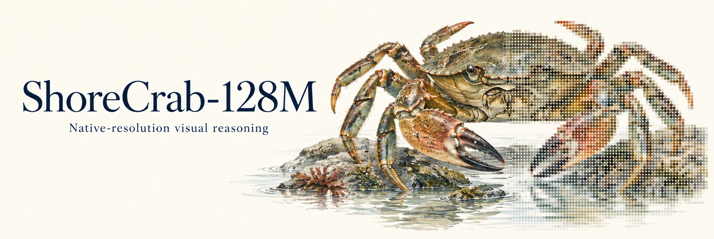

<p align="center"></p>

# Crab-cookbook

**ShoreCrab-128M (A60) is a compact visual decision model for applications with explicit answer choices.** Give it an image, a question and 2–16 candidates. It returns a probability for every candidate and an additional “none of these” outcome.

[Model card](https://huggingface.co/Haverbex/ShoreCrab-128M) · [Technical report](https://app.notion.com/p/3ede9d745acc80b0ab0ec91cd9e96ecb) · [Two output modes](docs/output-modes.md) · [Native engines](docs/native-engines.md) · [API](docs/api.md) · [Use cases](docs/use-cases.md)

## Two ways to consume a decision

Both modes use the same A60 inference result. Both require your candidate answers; A60 does not generate new answer text.

| Mode | Returned information | Use it for |
|---|---|---|
| Probabilities | The complete candidate distribution and None probability | Score displays, routing logic and application-specific review rules |
| Selection | The highest-probability candidate, or None | A single discrete application decision |

The probabilities are uncalibrated model outputs. A winning None outcome is preserved instead of forcing a candidate. Neither output is a validated safety confidence.

## Quick start: Python and HTTP

Python 3.11 or later is required. The client itself has no model-library dependencies.

```bash
python -m pip install -e .
export CRAB_BASE_URL=http://127.0.0.1:8090
```

Point the client at a running ShoreCrab server. Set `CRAB_API_KEY` if that server requires authentication.

### 1. Return all probabilities

```python
from shorecrab import CrabClient
from shorecrab.outputs import probability_view

client = CrabClient("http://127.0.0.1:8090")
choices = ["white", "red", "blue", "black"]
result = client.score("assets/kitchen.png", "What color is the mug?", choices)
scores = probability_view(choices, result)
for answer, probability in zip(scores["choices"], scores["probabilities"]):
    print(answer, probability)
print("None:", scores["none_probability"])
```

### 2. Select the highest-probability answer

```python
from shorecrab import CrabClient

client = CrabClient("http://127.0.0.1:8090")
selected = client.choose(
    "assets/kitchen.png",
    "What color is the mug?",
    ["white", "red", "blue", "black"],
)
print(selected["answer"], selected["probability"])
# answer is None when the model's None outcome wins.
```

Run the complete examples:

```bash
python examples/return_probabilities.py assets/kitchen.png
python examples/select_answer.py assets/kitchen.png
```

## Run the model locally

Download the public A60 inference bundle from [Hugging Face](https://huggingface.co/Haverbex/ShoreCrab-128M). **The weights are for non-commercial research** under the terms shipped with the model. Cookbook code uses Apache-2.0. This is a research preview; the abstention release criterion did not pass.

```bash
python -m pip install -e '.[serve]' huggingface_hub
hf download Haverbex/ShoreCrab-128M --include 'bundle/*' 'LICENSE.md' 'notices/*' --local-dir model
crab-serve --bundle model/bundle --device cpu
```

A bundle contains `manifest.json`, `model.safetensors` and `tokenizer/`. The loader verifies file SHA256 values and executes in FP32. It does not silently fall back to another device.

For the PyTorch server on Apple Silicon:

```bash
PYTORCH_MPS_HIGH_WATERMARK_RATIO=0.6 \
PYTORCH_MPS_LOW_WATERMARK_RATIO=0.5 \
crab-serve --bundle /path/to/a60-inference-bundle --device mps
```

## Native llama.cpp and vLLM

The native paths execute A60's image encoder, text encoder and candidate-scoring graph inside each engine. Use the pinned **custom llama.cpp extension build** or the **registered vLLM pooling model**. Validation covers macOS Apple Silicon CPU FP32. Standard upstream `llama-server`, chat completions, GPU kernels and quantization are not claimed supported.

After following the [installation and conversion guide](docs/native-engines.md), choose either output mode:

```bash
# vLLM: complete candidate distribution
python -m shorecrab.native.vllm_cli --model /path/to/a60-vllm \
  --image assets/kitchen.png --question 'What color is the mug?' \
  --choices white red blue black --output-mode probabilities

# vLLM: highest-probability candidate or None
python -m shorecrab.native.vllm_cli --model /path/to/a60-vllm \
  --image assets/kitchen.png --question 'What color is the mug?' \
  --choices white red blue black --output-mode select
```

[Both llama.cpp examples](docs/output-modes.md#llamacpp) use the same `--output-mode` switch. They prepare pixels and token IDs in Python, then run full inference in the C++ extension.

## Application examples

```bash
python examples/catalogue.py assets/kitchen.png --items 'a mug' 'a chair' 'a phone'
python examples/relative_depth.py assets/kitchen.png 'white mug' 'green apple'
python examples/nearest_object.py assets/driving.png
python examples/robot_observation.py assets/kitchen.png
python examples/game_direction.py /path/to/game-frame.png
```

Questions are limited to 96 tokenizer tokens and each candidate to 48. Inputs beyond the supported limits are rejected. The technical report's game highlights use separate task-specific heads over A60 visual features; these generic reader examples do not reproduce those heads. Relative-depth choices are not metric depth maps, and robot observation examples do not establish control safety.

[Driving and parking example, complete results and fresh native checks](docs/driving-depth.md).

## License

The inference and example code, and the original driving/parking demonstration artwork, are licensed under [Apache-2.0](LICENSE). Model, data and third-party component terms are separate; see [NOTICE](NOTICE.md).
