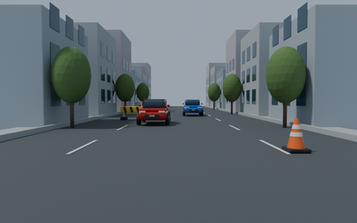

# Nearest-object decisions in traffic scenes



Give A60 an RGB image, a question and object names. The example prints the complete K+1 distribution and then selects its highest-probability outcome from the same request:

```bash
python examples/nearest_object.py assets/driving.png
python examples/nearest_object.py assets/parking.png --choices 'traffic cone' 'yellow barrier'
```

Start the local server using the [quick start](../README.md#run-the-model-locally). For engine-native inference, follow the [pinned installation guide](native-engines.md), then run:

```bash
# vLLM pooling worker
OMP_NUM_THREADS=2 python -m shorecrab.native.vllm_cli \
  --model /path/to/a60-vllm --image assets/driving.png \
  --question 'Which object is closest to the camera?' \
  --choices 'red car' 'blue car' 'traffic cone' 'yellow barrier' \
  --output-mode probabilities

# llama.cpp custom extension
OMP_NUM_THREADS=2 python -m shorecrab.native.llama_cpp_cli \
  --executable build/a60/llama-shorecrab --model /path/to/a60-f32.gguf \
  --tokenizer /path/to/a60-inference-bundle/tokenizer \
  --image assets/driving.png --question 'Which object is closest to the camera?' \
  --choices 'red car' 'blue car' 'traffic cone' 'yellow barrier' \
  --output-mode select
```

Both engines accept either `--output-mode probabilities` or `--output-mode select`. A60 requires supplied candidates and preserves a winning None; it does not generate answer text or a depth map.

## Recorded behaviour

The [technical report](https://app.notion.com/p/3ede9d745acc80b0ab0ec91cd9e96ecb) and [model card](https://huggingface.co/Haverbex/ShoreCrab-128M) contain two continuous procedural simulations. The unchanged A60 reader receives only unannotated RGB, the question and candidate names. Geometry-derived distances are reference labels displayed after inference.

| Scene | Forward-order matches | Both candidate orders |
|---|---:|---:|
| Approaching cars, cone and barrier | 7/24 | 14/48 |
| Moving parking camera, cone and barrier | 8/16 | 16/32 |

Every decision is retained at 2 Hz; playback follows simulation time. The reference is camera-to-object-centre distance, not surface clearance. Near-ties below 0.25 m are flagged and included. These two scenes reveal unreliable nearest-object selection and do not establish driving, navigation or collision-avoidance capability. [All outputs](driving-decisions.json).

## Independent engine checks

On 2026-10-03, three new traffic frames were each run in both candidate orders and both output modes through both engines: **24 actual CLI subprocess calls**. Both engines also rejected an invalid one-candidate request (**2 negative checks**). vLLM probabilities matched the original PyTorch reader exactly; the largest llama.cpp probability difference was **3.70e-6** (tolerance 2e-5). Selected answers also matched.

These are macOS CPU FP32 implementation checks, independent of scene accuracy. Startup-inclusive process times in the [receipt](native-driving-validation.json) are not inference latency. The receipt does not validate GPU execution, quantization, concurrent requests or standard upstream llama-server.

## License

The example code and original procedural driving/parking artwork use [Apache-2.0](../LICENSE). Model weights have separate terms and are not relicensed by this example; see [NOTICE](../NOTICE.md).
